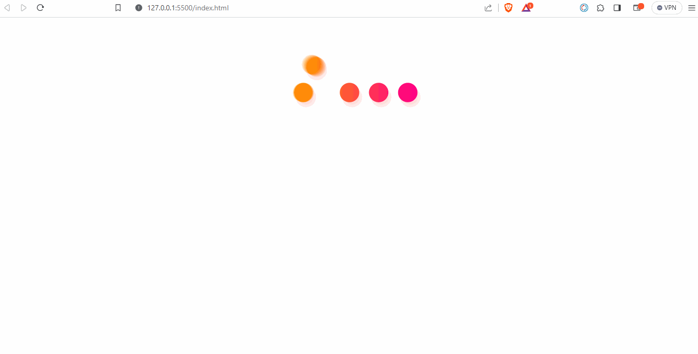

# Random Cat Images

# Pekiştirmek İstediğim Beklenen Konular
- setTimeOut() & setInterval()
- async() & .catch()
- Js DOM

# Amac
- Sayfa açıldıktan 3sn sonra **loadingDiv** ekrandan kaybolsun **containerDiv** görünür hale gelsin.
- Aşağıda verilen api adresine fetch() ve .then() metodunu kullanarak istek atmak. Ayrıca hatayı yakalamak içinde .catch()metodunu zincire eklemek. Gelen cevabı **cardDiv** içerisine yazdırmak.
- Sayfa yüklendiğinde resimler ekrana gelsin. Aynı şekilde kullanıcı **btn** elementine tıkladığında da istek atılsın resimler yenilensin.
- Eğer istekte hata meydana gelirse **cardDiv** içerisinde [hata resmi](./img/error.gif) ekrana gelsin.
- Apiden response gelene kadar **cardDiv** içerisinde [laoding resmi](./img/loading.gif) ekrana gelsin.
- **tarih** elementininin innerText ine anlık olarak tarih ve saat bilgisini yazdırmak.

## Beklenen Çıktı

## Demo

[Live](https://halilkoca07.github.io/Teamwork/Java-Script/ASS/ass-003/index.html)

## Not:
1. Kulladığım API adresi => "https://api.thecatapi.com/v1/images/search?limit=10"
